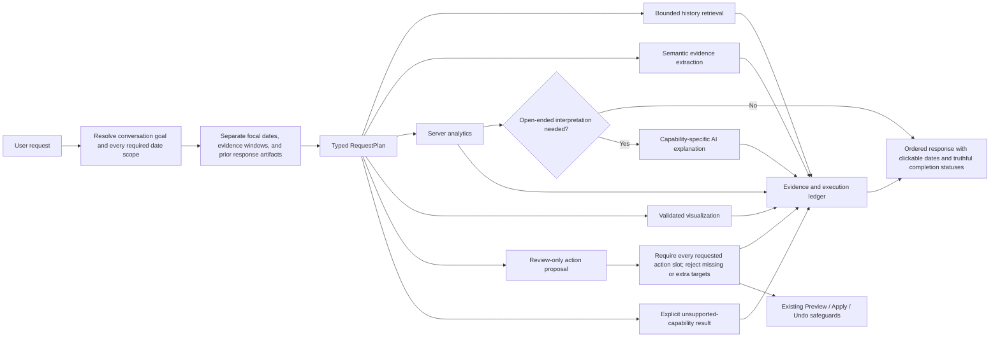

# PT Motivator AI System: Comprehensive Flowchart

Implementation snapshot updated on 2026-07-16. The rendered route-family diagrams include the executable analytics, capability-specific prompt, provider-independent fallback, exact semantic count, and multi-action planning paths now present in the Ask route.

This document maps the implemented Ask AI, model-routing, history-retrieval, visualization, agent-preview, apply, undo, and persistence paths. It is written for a technically informed reader and is intended to be read with the detailed [Ask AI and Agent Handoff](./ASK_AI_AGENT_HANDOFF.md).

The diagrams cover every implemented routing **family** and terminal outcome. Natural-language inputs are effectively unbounded, so a diagram cannot enumerate every sentence a user might type; it can show every code path those sentences can enter.

Every diagram is embedded as a zoom-safe SVG. Click a diagram to open the full-size vector; expand **Editable Mermaid source** beneath it to inspect or change the original diagram definition.

## Current typed execution overlay

The route families below are no longer treated as mutually exclusive user goals. The server first creates a dependency-aware plan, then executes the necessary existing capabilities and verifies which requested outputs actually completed.



Important boundaries:

- The plan coordinates multiple subgoals; it does not authorize writes.
- Models interpret requests and explain evidence. Server code retrieves records, computes supported chart values, validates evidence, and executes approved actions.
- Supported structured calculations are terminally complete without a provider: the server composes the factual answer, coverage, evidence, visual, and clickable dates directly. Multi-measure requests preserve each requested operation, and coverage subgoals such as observed count and missing count are first-class outputs.
- Comparative requests bind every named period to the analytics step and load their bounded union; “past 7 days versus 7 days before” therefore analyzes 14 calendar days rather than only the first window.
- Model prompts are projected by capability. Read questions do not carry mutation schemas or the exercise library, analytics interpretation receives verified server results, and action planning receives only its contract and relevant targets. Prior response artifacts are carried as compact structured state, not raw assistant prose.
- Compound direct commands are split outside quoted values, compiled independently, and coalesced so wording inside a saved note cannot steal another action's target.
- Explicit action commands create required slots keyed by exact type, date, and entity. A model plan is rejected if any requested slot is absent or if an unrelated target is introduced. Complete deterministic action plans return review cards directly, including doctor-note creation and doctor-note response appends.
- Focal dates (for example “today”) are kept separate from broader evidence windows (for example “based on my recent notes”), and compact prior visual/execution/action artifacts are carried into follow-ups without letting those artifacts create new visualization or analytics intent.
- Rolling “past month” and explicit calendar-month scopes are resolved differently: rolling month uses the current 30-day window, while calendar language binds calendar dates.
- Unsupported derived operations return the supported scope and exact missing capability; they do not fall through to a generic recap, an unrelated chart, or a falsely successful execution record. Exact literal count requests with an explicit term list use a deterministic evidence artifact and disclose that synonyms were not inferred.
- Stable domain-command IDs insulate planning from tables and `user_config`; full shared UI/AI command handlers remain the next migration step.
- A compact execution record exposes scope, coverage, calculations, assumptions, and incomplete outputs without duplicating large note excerpts.
- One request-wide deadline ends before the browser timeout, with cancellation propagated through provider and repair calls.

## Legend

| Shape or label | Meaning |
| --- | --- |
| Browser | React client code and user-visible state |
| Next.js route | Server-owned API boundary |
| Deterministic | Code computes or validates the result without trusting a model |
| AI provider router | Task-aware Gemini, Groq, Cerebras, and free OpenRouter cascade |
| Neon | Persistent PostgreSQL data |
| Degraded | Useful bounded fallback after model/provider failure |
| Review card | Proposed action only; no write has occurred |

## 1. Master end-to-end system flow

[](./diagrams/ai-system-master-flow.svg)

<details>
<summary>Editable Mermaid source</summary>

```text
flowchart TD
    U["User"] --> ENTRY{"Entry point"}

    subgraph Browser["Browser / React client"]
        ENTRY -->|Ask or follow up| MODAL["ExerciseAiCoachModal"]
        ENTRY -->|AI note logging| AILOGUI["AI log UI"]
        ENTRY -->|Exercise generation or editing| EDITUI["Exercise editor"]
        ENTRY -->|Clean or summarize text| HELPERUI["Notes and summary UI"]
        ENTRY -->|Normal app use| APPUI["Tracker, health, doctor notes, media, timers"]

        MODAL --> SAN["Strip secret blocks; extract /ai instructions; append user turn immediately"]
        SAN --> CONTEXT["Build bounded API history, selected date, app date, compact exercise library, categories, sessions"]
        CONTEXT --> SOURCEQ{"Exercise-source lookup useful?"}
        SOURCEQ -->|Yes| SOURCEPRE["Parallel external exercise search preflight"]
        SOURCEQ -->|No| ASKPOST["POST /api/ai-exercise-question"]
        SOURCEPRE --> ASKPOST
    end

    subgraph AskRoute["Main Ask AI route"]
        ASKPOST --> PARSE["Parse, redact, normalize, recover conversational goal"]
        PARSE --> STATE["Recover compact prior goal, visual, execution, and action artifacts"]
        STATE --> CLASSIFY["Resolve focal dates separately from evidence scopes, history mode, outputs, and action permission"]
        CLASSIFY --> PLAN["Build typed RequestPlan with scope, analytics, action-slot bindings, and dependencies"]
        PLAN --> LOAD{"Does this request need saved history?"}
        LOAD -->|Yes| HIST["One bounded UNION query plus compact app context"]
        LOAD -->|No| EARLY
        HIST --> RETRIEVE["Complete window, whole scope, or deterministic ranking plus optional AI rerank"]
        RETRIEVE --> EARLY{"Special deterministic branch?"}

        EARLY -->|Completion coverage| COVERAGE["Deterministic completion answer"]
        EARLY -->|Existing saved photo inspection| PHOTOINFO["Photo metadata and captions only; no pixel vision"]
        EARLY -->|Semantic count visual| SEMANTIC["Evidence-backed semantic aggregation pipeline"]
        EARLY -->|Supported structured analytics| ANALYTICS["Server calculates and composes answer, coverage, evidence, visual, and dates"]
        EARLY -->|Open-ended reasoning remains| PROMPT["Project capability-specific context and JSON contract"]

        PROMPT --> TASK{"Task route"}
        TASK -->|Explicit app mutation or navigation| SLOTS["Compile required actions outside quoted payloads"]
        SLOTS --> AGENTTASK["agent"]
        TASK -->|Personal data or history| ASKTASK["ask"]
        TASK -->|General knowledge, no private history| PUBTASK["publicAsk"]
        AGENTTASK --> ROUTER["Shared AI provider router"]
        ASKTASK --> ROUTER
        PUBTASK --> ROUTER

        ROUTER --> CONTRACT{"Valid JSON and task contract?"}
        CONTRACT -->|No; another route remains| ROUTER
        CONTRACT -->|Yes| NORMALIZE["Normalize answer, actions, visuals, options, dates, debug metadata"]
        CONTRACT -->|All providers fail| FALLBACK["Task-aware deterministic or degraded fallback"]

        NORMALIZE --> GUARDS["Contradiction guard; action gate; visual validation; date-link invariant"]
        FALLBACK --> GUARDS
        COVERAGE --> RESPONSE["Structured API response"]
        PHOTOINFO --> RESPONSE
        SEMANTIC --> RESPONSE
        ANALYTICS --> RESPONSE
        GUARDS --> RESPONSE
    end

    subgraph ProviderCloud["External AI and content services"]
        ROUTER --> GEMINI["Google Gemini"]
        ROUTER --> GROQ["Groq model pool and keys 1-4"]
        ROUTER --> CEREBRAS["Cerebras"]
        ROUTER --> OPENROUTER["OpenRouter free-only models"]
        SOURCEPRE --> EXERCISEDB["ExerciseDB"]
        SOURCEPRE --> APININJAS["API Ninjas Exercises"]
    end

    subgraph Data["Neon PostgreSQL"]
        HIST --> HEALTHDATA["health_log"]
        HIST --> EXDATA["workout_log, exercise_notes, exercise_metrics"]
        HIST --> DOCDATA["doctor_notes when relevant"]
        HIST --> CONFIGDATA["user_config metadata and app context"]
        CHATAPI["/api/ai-chat-sessions"] <--> CHATDATA["ai_chat_sessions"]
        APPLYAPI["/api/ai-agent"] --> APPDATA["Logs, notes, health, metrics, doctor notes, config"]
        APPLYAPI --> RUNDATA["ai_agent_runs and undo payload"]
        UNDOAPI["/api/ai-agent/undo"] --> RUNDATA
        UNDOAPI --> APPDATA
    end

    RESPONSE --> CLIENTNORM["Client normalizes reply; caps links and summaries; stores model/debug data"]
    CLIENTNORM --> PLANQ{"agentPlan present?"}
    PLANQ -->|No| RENDER["Render prose, options, visual cards, evidence drilldowns, clickable dates"]
    PLANQ -->|Yes| PREVIEWAPI["POST /api/ai-agent/preview"]
    PREVIEWAPI --> REVIEW["Validated review card with visible values and risk labels"]
    REVIEW --> REVIEWACTION{"User choice"}
    REVIEWACTION -->|Navigate| NAV["Open app destination; no write"]
    REVIEWACTION -->|Select rows, optional photo, Apply| APPLYAPI
    REVIEWACTION -->|Do nothing| NOWRITE["No state change"]
    APPLYAPI --> CALLBACK["Return affected dates and changed config"]
    CALLBACK --> REFRESH["Patch/reload relevant client state without full-page refresh"]
    CALLBACK --> UNDOUI["Expose app-level Undo"]
    UNDOUI --> UNDOAPI
    UNDOAPI --> REFRESH

    CLIENTNORM --> CHATAPI
    REVIEW --> CHATAPI
    APPLYAPI --> CHATAPI
    UNDOAPI --> CHATAPI

    AILOGUI --> AILOG["POST /api/ai-log"]
    EDITUI --> AIEDIT["POST /api/ai-exercise-edit"]
    HELPERUI --> HELPERS["standardize-note, doctor-note-cleanup, daily-summary"]
    AILOG --> ROUTER
    AIEDIT --> ROUTER
    HELPERS --> ROUTER
    APPUI --> CRUD["Bounded app CRUD, media, external video, and push routes"]
    CRUD --> APPDATA
```

</details>

## 2. Ask AI routing decision tree

The main route is [`app/api/ai-exercise-question/route.ts`](../app/api/ai-exercise-question/route.ts). Classification does not replace the model's reasoning. It decides what context and tools to give the model, whether a write-capable protocol is allowed, and which deterministic guarantees must wrap the answer.

[](./diagrams/ask-ai-routing-decision-tree.svg)

<details>
<summary>Editable Mermaid source</summary>

```text
flowchart TD
    START["POST question, recent conversation, app context"] --> CLEAN["Limit input; extract /ai; redact secret blocks by default"]
    CLEAN --> SECRET{"Latest /ai explicitly permits secret notes?"}
    SECRET -->|Yes| INCLUDE["Include secret note text and disclose use in answer/debug"]
    SECRET -->|No| REDACT["Keep secret note text out of model and history corpus"]
    INCLUDE --> GOAL
    REDACT --> GOAL["Resolve effective analytical goal from current turn plus dependent follow-ups"]

    GOAL --> WINDOW{"Time scope found?"}
    WINDOW -->|today| TODAY["One calendar day: app today"]
    WINDOW -->|yesterday| YDAY["One previous calendar day"]
    WINDOW -->|today plus yesterday| TWO["Two complete calendar days"]
    WINDOW -->|past week| PASTWEEK["Previous seven complete days; excludes today"]
    WINDOW -->|this week| THISWEEK["Week start through today"]
    WINDOW -->|N days, weeks, or months| NDAYS["Bounded calendar window; optional through today"]
    WINDOW -->|Comparison names a preceding period| MULTI["Resolve named current and prior windows; load their bounded union"]
    WINDOW -->|Recent notes without a number| RECENT["Seven calendar days through today"]
    WINDOW -->|Follow-up inherits prior scope| INHERIT["Reuse previous bounded window"]
    WINDOW -->|Whole history language| WHOLE["Bounded configured history horizon, extended for explicit older dates"]
    WINDOW -->|No explicit window| NOWINDOW["Ranked retrieval only if the request needs personal history"]

    TODAY --> INTENTS
    YDAY --> INTENTS
    TWO --> INTENTS
    PASTWEEK --> INTENTS
    THISWEEK --> INTENTS
    NDAYS --> INTENTS
    MULTI --> INTENTS
    RECENT --> INTENTS
    INHERIT --> INTENTS
    WHOLE --> INTENTS
    NOWINDOW --> INTENTS["Compute independent intent flags"]

    INTENTS --> I1["Mutation or navigation"]
    INTENTS --> I2["History lookup or summary"]
    INTENTS --> I3["Pattern, comparison, or whole-history analysis"]
    INTENTS --> I4["Visualization"]
    INTENTS --> I5["Semantic free-text aggregate"]
    INTENTS --> I6["Completion coverage"]
    INTENTS --> I7["Existing attached-photo inspection"]
    INTENTS --> I8["Bulk note-driven agent action"]
    INTENTS --> I9["General conversational or public question"]

    I1 --> MUTATIONBOUNDARY{"Explicit persistence or navigation language?"}
    MUTATIONBOUNDARY -->|No: advice, interpretation, symptoms, recommendations| CHATONLY["Read-only conversation; model cannot manufacture an Apply card"]
    MUTATIONBOUNDARY -->|Yes| AGENTMODE["Agent planning is permitted"]

    I2 --> NEEDHIST
    I3 --> NEEDHIST
    I4 --> NEEDHIST
    I5 --> NEEDHIST
    I6 --> NEEDHIST
    I7 --> NEEDHIST
    I8 --> NEEDHIST
    CHATONLY --> NEEDHIST{"Load saved history?"}
    AGENTMODE --> NEEDHIST
    I9 --> NEEDHIST

    NEEDHIST -->|Bounded window, history, pattern, visual, bulk, or /ai requires it| LOAD["Load bounded saved records"]
    NEEDHIST -->|No personal context needed| NOLOAD["No Neon history query"]
    LOAD --> MODE{"Retrieval mode"}
    MODE -->|Semantic aggregate| ALLNOTES["Every applicable note field in scope"]
    MODE -->|Supported structured analytics| ALLROWS["Every bounded daily row; skip relevance reranking"]
    MODE -->|Window is 31 days or less| FULLWINDOW["Every calendar day in the requested range, including empty days"]
    MODE -->|Whole-history analysis| WHOLECOMPACT["All bounded days for compact comparison plus rich ranked candidates"]
    MODE -->|Other history request| RANK24["Deterministic rank up to 24 candidate days"]
    RANK24 --> RERANK{"AI reranker available?"}
    RERANK -->|Yes| TOP8["Reranker selects up to 8; deterministic evidence retained"]
    RERANK -->|No or fails| TOP8D["Deterministic top 8"]

    ALLNOTES --> TERMINAL
    ALLROWS --> TERMINAL
    FULLWINDOW --> TERMINAL
    WHOLECOMPACT --> TERMINAL
    TOP8 --> TERMINAL
    TOP8D --> TERMINAL
    NOLOAD --> TERMINAL{"Execute required plan capabilities; outputs may coexist"}

    TERMINAL -->|Completion coverage with window| TCOVER["Return deterministic answer and optional deterministic visual"]
    TERMINAL -->|Saved-photo inspection| TPHOTO["Return photo count/captions and clickable target date"]
    TERMINAL -->|Semantic count visual| TSEM["Run evidence-backed semantic pipeline"]
    TERMINAL -->|Supported structured calculation| TANALYTICS["Calculate and compose deterministic answer; no provider required"]
    TERMINAL -->|Open-ended interpretation or unsupported operation| TASKSEL{"Capability-specific model task"}
    TASKSEL -->|Agent mode| TAGENT["agent"]
    TASKSEL -->|Personal/history context| TASK["ask"]
    TASKSEL -->|No private history| TPUB["publicAsk"]

    TAGENT --> KEYCHECK{"Configured provider route exists?"}
    TASK --> KEYCHECK
    TPUB --> KEYCHECK
    KEYCHECK -->|No, but deterministic agent plan exists| DPLAN["Return review plan as degraded deterministic result"]
    KEYCHECK -->|No usable key and no deterministic plan| HTTP500["HTTP 500: missing provider keys"]
    KEYCHECK -->|Yes| MODEL["Run task-specific provider cascade"]

    MODEL -->|Valid response| POST["Normalize and validate artifacts"]
    MODEL -->|Provider cascade fails| FAIL{"Fallback family"}
    FAIL -->|Deterministic agent plan| DPLAN
    FAIL -->|Verified structured analytics| TANALYTICS
    FAIL -->|Explicit semantic category list| DEXACT["Count exact supplied wording with evidence; disclose no synonym expansion"]
    FAIL -->|Requested recap or coverage| DRECAP["Saved-data deterministic recap"]
    FAIL -->|Needs unavailable derived-event capability| DUNSUPPORTED["Return exact unsupported capability and incomplete outputs"]
    FAIL -->|Strongly supported history dates| DDATE["Degraded failure plus supported clickable dates"]
    FAIL -->|Advice, interpretation, explanation, or general chat| DGEN["Transparent provider-unavailable response; no fake recap"]
    FAIL -->|Unexpected non-router exception| OUTER["Outer error payload; HTTP 500 or 502"]

    POST --> ACTIONCHECK{"Server classified request as agent?"}
    ACTIONCHECK -->|No| DROPPLAN["Discard any model-proposed actions"]
    ACTIONCHECK -->|Yes| MERGEPLAN["Merge deterministic and relevant model actions; coalesce conflicts"]
    MERGEPLAN --> SLOTGUARD["Require every exact action slot; reject missing or unrelated targets"]
    SLOTGUARD --> VALIDPLAN{"Valid plan exists?"}
    VALIDPLAN -->|No| REPAIR["Dedicated agent repair call"]
    REPAIR -->|Valid| PLANOUT["Review-card response"]
    REPAIR -->|Still invalid| CLARIFY["Concrete clarification or planning status"]
    VALIDPLAN -->|Yes| PLANOUT
    TANALYTICS --> ANSWERGUARD
    DEXACT --> ANSWERGUARD
    DUNSUPPORTED --> ANSWERGUARD
    DROPPLAN --> ANSWERGUARD
    PLANOUT --> ANSWERGUARD
    CLARIFY --> ANSWERGUARD["Final response guards"]
    ANSWERGUARD --> CONTRADICTION["Replace false no-data claims when saved records prove otherwise"]
    CONTRADICTION --> DATEINV["Synthesize and merge dateLinks for real saved dates named in answer"]
    DATEINV --> VISUALINV["Prefer verified deterministic visuals; otherwise normalized model visuals"]
    VISUALINV --> RETURN["Return answer, options, date links/summaries, plan, visuals, model/provider/debug"]
```

</details>

### Routing principles

- “What stood out this past week?” enters the complete seven-day window, not a single-day lookup.
- “Give me treatment advice” remains conversational. Words such as “treatment,” “note,” or a symptom do not authorize a database mutation.
- “Record pain as 6.5 today” opens the agent protocol because it explicitly requests persistence.
- “Make a table of each toe and its count” combines whole-history, visualization, and semantic-text aggregation.
- “Triple check” or “do what I asked” can inherit the prior analytical goal and scope rather than becoming a context-free request.
- “Average pain for the past seven days versus the seven days before” binds both periods, computes both averages on the server, and does not call a model or reranker.
- “Set pain, append this health note, and complete calf raises” becomes three independently validated review actions; quoted note text is never treated as an exercise target.
- A model may reason freely inside the selected context, but only server code can open write mode, validate actions, execute writes, or certify evidence.

## 3. Saved-history loading and ranking

[](./diagrams/history-loading-ranking.svg)

<details>
<summary>Editable Mermaid source</summary>

```text
flowchart LR
    SCOPE["Resolved start and end dates"] --> UNION["One bounded UNION ALL query"]

    subgraph Tables["Neon source tables"]
        WL["workout_log: completion"]
        EN["exercise_notes: text plus photo metadata"]
        HL["health_log: metrics, public note text, optional secret text"]
        EM["exercise_metrics: sets, reps, duration, weight"]
    end

    WL --> UNION
    EN --> UNION
    HL --> UNION
    EM --> UNION
    PT["PT and training sessions already present in app context"] --> ASSEMBLE
    UNION --> ASSEMBLE["Assemble one DayRecord per saved date"]
    ASSEMBLE --> COMPACT["Clip text, omit image pixels, map exercise IDs to names"]

    COMPACT --> PATH{"Requested analysis"}
    PATH -->|Complete bounded window| CAL["Calendar-complete records; empty dates retained"]
    PATH -->|Structured analytics| STRUCTCAL["All required bounded rows; no relevance reranking or model calculation"]
    PATH -->|Semantic text counting| CORPUS["All applicable note fields in scope"]
    PATH -->|Whole history| ALL["Compact row per day plus bounded note corpus"]
    PATH -->|Relevance lookup| INDEX["Field-aware deterministic index"]

    INDEX --> BM25["BM25-like lexical score"]
    INDEX --> FUZZY["Fuzzy n-gram similarity"]
    INDEX --> PROX["Phrase and term proximity"]
    INDEX --> STRUCT["Structured health, activity, and session evidence"]
    INDEX --> TEMP["Explicit dates, relative time, recency"]
    INDEX --> METRIC["Metric and completion evidence"]
    BM25 --> MERGE["Weighted merged score and evidence"]
    FUZZY --> MERGE
    PROX --> MERGE
    STRUCT --> MERGE
    TEMP --> MERGE
    METRIC --> MERGE
    MERGE --> CAND["At most 24 candidates"]
    CAND --> RERANK{"Groq reranker succeeds within its own budget?"}
    RERANK -->|Yes| SELECT["Up to 8 selected dates"]
    RERANK -->|No| DET["Deterministic top 8"]

    CAL --> PROMPT["Prompt context and deterministic analytics"]
    CORPUS --> PROMPT
    ALL --> PROMPT
    SELECT --> PROMPT
    DET --> PROMPT
    STRUCTCAL --> DIRECT["Deterministic analytics executor, evidence ledger, and response composer"]
```

</details>

Cost and privacy properties of this path:

- Date ranges are bounded; the normal history horizon is configurable but capped.
- The main load is one query across only the fields used by Ask AI.
- Saved image bytes/base64 are not loaded for background reasoning; only attachment count and captions are included where supported.
- Doctor notes are queried separately only for doctor/provider-related questions, with clipped text and a fixed limit.
- Secret blocks are excluded unless the latest `/ai` instruction explicitly grants access.
- Reranking reduces rich main-model context; it does not remove required days from a complete bounded window or semantic whole-scope count.
- Reranking is skipped entirely for supported structured analytics because relevance cannot improve a complete arithmetic calculation.
- Only genuinely open-ended reasoning receives a model prompt, and that prompt is projected to the active capability instead of carrying the route's universal context.

## 4. AI provider and model failover state machine

The shared router is [`lib/groq.ts`](../lib/groq.ts). The legacy function name `callGroqChat` now fronts every supported provider.

[](./diagrams/provider-model-failover.svg)

<details>
<summary>Editable Mermaid source</summary>

```text
flowchart TD
    CALL["callGroqChat(task, prompt, contract, budgets, abort signal)"] --> PLAN["Build ordered task-specific AiRoute list"]
    PLAN --> PASS1["First pass: one viable route per distinct provider"]
    PASS1 --> ROUTE["Take next scheduled provider and model route"]
    ROUTE --> KEYS["Enumerate configured keys for that provider"]
    KEYS --> SKIP{"Key disabled or model/key in cooldown?"}
    SKIP -->|Yes| NEXTKEY["Next key"]
    SKIP -->|No| ADAPT["Adapt request shape for OpenAI-compatible API or Gemini contents"]
    ADAPT --> TIMER["Start per-attempt timeout; honor caller cancellation and total deadline"]
    TIMER --> REQUEST["Provider HTTPS request"]

    REQUEST --> STATUS{"HTTP/network result"}
    STATUS -->|2xx| CONTENT{"Non-empty assistant content?"}
    CONTENT -->|No| EMPTY["Record EMPTY_RESPONSE"]
    CONTENT -->|Yes| JSONQ{"JSON or structured artifact required?"}
    JSONQ -->|No| SUCCESS["Return normalized response, actual model, provider key label, attempts"]
    JSONQ -->|Yes| PARSE{"Valid JSON object?"}
    PARSE -->|No| INVALID["Record INVALID_JSON_RESPONSE; move to next route"]
    PARSE -->|Yes| CHECKS{"Required contract satisfied?"}
    CHECKS -->|Agent| ACHECK["Actions or concrete clarification present"]
    CHECKS -->|Visualization| VCHECK["Non-empty visual artifact present"]
    CHECKS -->|Semantic| SCHECK["Usable category plan and evidence contract"]
    CHECKS -->|Request-specific acceptJson| JCHECK["Caller validator accepts JSON"]
    CHECKS -->|No extra contract| SUCCESS
    ACHECK -->|Pass| SUCCESS
    VCHECK -->|Pass| SUCCESS
    SCHECK -->|Pass| SUCCESS
    JCHECK -->|Pass| SUCCESS
    ACHECK -->|Fail| INVALID
    VCHECK -->|Fail| INVALID
    SCHECK -->|Fail| INVALID
    JCHECK -->|Fail| INVALID

    STATUS -->|401 or 403| DISABLE["Disable key for process lifetime"]
    STATUS -->|429| COOL["Set model/key cooldown from Retry-After; try another quota pool"]
    STATUS -->|400, 404, or 422| MODELERR["Request/model incompatibility; skip remaining keys for this route"]
    STATUS -->|Attempt timeout| TIMEOUT["Skip to another provider/model; do not waste alternate keys"]
    STATUS -->|Caller cancelled| CANCEL["Stop cascade"]
    STATUS -->|Other error| OTHER["Record attempt; continue if budget remains"]

    EMPTY --> BUDGET
    INVALID --> BUDGET
    DISABLE --> BUDGET
    COOL --> BUDGET
    MODELERR --> BUDGET
    TIMEOUT --> BUDGET
    OTHER --> BUDGET{"Another route/key and time/attempt budget remains?"}
    NEXTKEY --> BUDGET
    BUDGET -->|Yes; first pass incomplete| ROUTE
    BUDGET -->|Yes; every provider had a chance| PASS2["Second pass: alternate keys/models within per-route cap"]
    PASS2 --> ROUTE
    BUDGET -->|No| FAIL["Throw GroqRouteError with every recorded attempt"]
    CANCEL --> FAIL
```

</details>

### Task-specific route priorities

Environment overrides can prepend approved Groq models, but model names remain allow-listed. Duplicate provider/model routes and duplicate keys are removed.

| Task | Primary route order | Contract |
| --- | --- | --- |
| `agent` | Gemini 3.5 Flash → strongest Groq route → Cerebras GPT-OSS 120B → Gemini Flash Lite → remaining Groq → free OpenRouter → Cerebras preview | JSON action plan or concrete clarification |
| `ask` | Gemini/Groq/Cerebras interleave → free OpenRouter → remaining Groq/Cerebras | JSON answer; personal context allowed |
| `publicAsk` | Gemini public model list → Groq public/compound routes → Cerebras → free OpenRouter → remaining Groq | JSON answer without saved-history dependency |
| `semantic` | Gemini 3.5 Flash → Cerebras GPT-OSS 120B → free Qwen route → Groq → Gemini Flash Lite → other free/preview capacity | Exact category ontology/aliases accepted by caller validator |
| `rerank` | Groq-only rerank chain, starting with Scout-oriented route | Valid selected date list |
| `log`, `edit`, `summary` | Short-task Gemini/Groq/Cerebras mix, including Cerebras GLM short-context route | Endpoint-specific JSON |
| `enhance`, `standardize` | Stronger Gemini/Groq/Cerebras mix → free OpenRouter → remaining routes | Endpoint-specific enhanced/standardized text JSON |

Current Groq families include GPT-OSS 120B/20B, Llama 3.3 70B, Qwen 3 32B, Llama 4 Scout, Qwen 3.6 27B, Llama 3.1 8B, plus Compound routes for `publicAsk`. OpenRouter routes are explicitly free-only. Up to four Groq API-key pools can be tried for quota failover, but alternate Groq credentials cannot monopolize the diversity-first pass.

The browser stops an Ask AI request after 45 seconds and the server-wide request deadline ends at 38 seconds. Every provider and repair budget is derived from the remaining shared deadline, with response-assembly reserve and caller cancellation propagated through the cascade. The main answer call permits four real network attempts, at most two on one provider/model route, and preserves a first-pass opportunity for distinct configured providers.

## 5. Evidence-backed semantic visualizations

This path handles questions such as frequency counts over inconsistent natural language. The model discovers meaning and aliases; code verifies the source evidence and computes the final numbers.

[](./diagrams/semantic-visualization-evidence.svg)

<details>
<summary>Editable Mermaid source</summary>

```text
flowchart TD
    Q["Semantic count or category visualization request"] --> SCOPE["Use every applicable saved-note field in requested scope"]
    SCOPE --> SOURCES["Create source records: stable sourceId, date, field label, clipped text"]
    SOURCES --> FILTER["Deterministically filter obviously irrelevant fields while retaining requested scope"]
    FILTER --> CHUNK["Chunk corpus by character budget"]

    CHUNK --> SCHEMA["AI semantic schema pass: exact requested entities and category count"]
    SCHEMA --> SCHEMAV{"Server validates category cardinality, labels, uniqueness, and shape"}
    SCHEMAV -->|Fail| EXPLICIT{"Did the user explicitly list every category?"}
    EXPLICIT -->|Yes; provider routes exhausted| EXACT["Build exact-wording category plan; keep zero categories and disclose no synonym inference"]
    EXACT --> MATCH
    EXPLICIT -->|No or terminology expansion still viable| NEXTSCHEMA["Provider router tries another model"]
    NEXTSCHEMA --> SCHEMA
    SCHEMAV -->|Pass| EACH["For each text chunk"]

    EACH --> ALIAS["AI extraction pass: aliases/phrases actually present for each category"]
    ALIAS --> ALIASV["Server requires exact source wording; drops unsupported aliases"]
    ALIASV --> MORE{"More chunks?"}
    MORE -->|Yes| EACH
    MORE -->|No| MERGE["Merge compatible category plans"]

    MERGE --> MATCH["Find bounded exact occurrences; prevent overlapping double-counts"]
    MATCH --> COUNT["Server recomputes category totals from verified matches"]
    COUNT --> EVIDENCE["Build drilldowns with sourceId, date, field, excerpt, matched text, count"]
    EVIDENCE --> FINALV["Validate every positive visual claim has evidence"]
    FINALV -->|Pass| VIS["Return table or bar visual; count cells open exact evidence"]
    FINALV -->|Fail| SAFEFAIL["Return no chart and say a source-verified artifact could not be produced"]
```

</details>

This intentionally prevents three common failure modes:

1. A model cannot substitute an unrelated generic health chart for the requested categories.
2. A model cannot invent totals; the server recomputes counts from source text.
3. A count is auditable: the user can open the exact dates, note fields, excerpts, and matched wording.

## 6. Response assembly and UI rendering

[](./diagrams/response-ui-rendering.svg)

<details>
<summary>Editable Mermaid source</summary>

```text
flowchart LR
    RAW["Model or deterministic branch"] --> ANSWER["Clean answer and options"]
    RAW --> DATES["Validate model dateLinks against loaded and supported dates"]
    ANSWER --> EXTRACT["Extract real saved dates named in answer"]
    DATES --> MERGEDATES["Merge, deduplicate, cap"]
    EXTRACT --> MERGEDATES
    MERGEDATES --> SUMMARY["Build date summaries from already loaded records"]

    RAW --> VIS["Deterministic visual or normalized model visual"]
    VIS --> VCAP["At most three validated visuals"]
    RAW --> PLAN["Optional normalized agent plan"]
    RAW --> DEBUG["Model, provider key, attempts, scopes, intent flags, degraded state"]

    ANSWER --> PAYLOAD["AiReply payload"]
    SUMMARY --> PAYLOAD
    VCAP --> PAYLOAD
    PLAN --> PAYLOAD
    DEBUG --> PAYLOAD

    PAYLOAD --> CLIENT["Client normalization"]
    CLIENT --> PROSE["Prose and suggestions"]
    CLIENT --> DATEUI["Clickable date tiles: open day in app"]
    CLIENT --> VISUI["Tables, line/bar charts, evidence drilldowns"]
    CLIENT --> PLANUI["Review card with complete proposed values"]
    CLIENT --> META["Actual model/provider and optional debug archive"]
    CLIENT --> SAVE["Persist conversation to ai_chat_sessions"]
```

</details>

Permanent response invariants:

- If an answer mentions a real loaded calendar date, the corresponding `dateLinks` entry must survive normal output, validation, model repair, deterministic output, and degraded fallback.
- A visual request either returns a relevant validated artifact or a transparent failure; it must not silently substitute an unrelated dashboard.
- A non-agent question cannot become a mutation merely because a model proposed actions.
- A review-card answer says nothing changed, and the card shows the actual proposed values before Apply.
- A saved-photo question never asks the user to upload the same image again when attachment metadata already proves it is saved.

## 7. Agent planning, preview, apply, refresh, and undo

[](./diagrams/agent-apply-undo.svg)

<details>
<summary>Editable Mermaid source</summary>

```text
flowchart TD
    CMD["Explicit user command to change or navigate app state"] --> DET["Deterministic parser builds plan where intent is structurally clear"]
    CMD --> MODEL["Agent model proposes structured actions"]
    DET --> MERGE["Keep requested action families; prefer explicit targets; coalesce duplicates/conflicts"]
    MODEL --> MERGE
    MERGE --> PLANQ{"Usable plan?"}
    PLANQ -->|No| REPAIR["Dedicated agent repair model call"]
    REPAIR -->|No plan, missing required detail| CLARIFY["Ask one concrete clarification"]
    REPAIR -->|Plan| PREVIEW
    PLANQ -->|Yes| PREVIEW["POST /api/ai-agent/preview"]

    PREVIEW --> NORMAL["Normalize and validate action types and limits"]
    NORMAL --> CFG["Load only config keys touched by the actions"]
    CFG --> TARGETS["Validate exercise/category/doctor-note targets"]
    TARGETS --> BULK{"Bulk note rule?"}
    BULK -->|Yes| EXPAND["One bounded server query expands matches to completion actions"]
    BULK -->|No| COALESCE
    EXPAND --> COALESCE["Coalesce and enforce action/photo limits"]
    COALESCE --> ITEMS["Generate human-readable preview items with dates, values, and risk"]
    ITEMS --> CARD["Review card"]

    CARD --> USER{"User decision"}
    USER -->|Navigate action| NAV["Client opens destination; no database write"]
    USER -->|Deselect rows| CARD
    USER -->|Choose photo and optional caption| CARD
    USER -->|Apply selected writes| APPLY["POST /api/ai-agent"]
    USER -->|Cancel or close| NONE["No change"]

    APPLY --> REVALIDATE["Revalidate and re-expand selected actions against current state"]
    REVALIDATE --> IDEM["Create or read idempotent ai_agent_runs row by requestId"]
    IDEM --> STATUS{"Run status"}
    STATUS -->|Already applied| ALREADY["Return prior success"]
    STATUS -->|Applying or invalid conflict| CONFLICT["Reject duplicate/conflicting execution"]
    STATUS -->|Ready| PREREAD["Batch-read only touched current rows and required photo metadata"]
    PREREAD --> UNDO["Construct inverse undo payload before writes"]
    UNDO --> PAYLOADS["Build batched JSON payloads by table/config family"]
    PAYLOADS --> TX["Serializable Neon transaction; every statement gated on run status applying"]

    TX --> LOGS["workout_log"]
    TX --> NOTES["exercise_notes and photos"]
    TX --> HEALTH["health_log and general-note photos"]
    TX --> METRICS["exercise_metrics"]
    TX --> DOCTORS["doctor_notes and photos"]
    TX --> CONFIG["exercise library, layout, sessions, widgets, title"]
    TX --> RUN["Mark ai_agent_runs applied"]
    RUN --> CHAT["Persist applied run metadata in chat message"]
    CHAT --> RESULT["Return runId, affectedDates, changedConfig"]
    RESULT --> PATCH["onAgentApplied patches/reloads only affected client state"]
    PATCH --> UNDOUI["App Undo target"]

    UNDOUI --> UNDOPOST["POST /api/ai-agent/undo"]
    UNDOPOST --> FIND["Load run and stored undo payload"]
    FIND --> USTATUS{"Run status"}
    USTATUS -->|Already undone| UIDEMP["Return idempotent success"]
    USTATUS -->|Not applied| U409["409: unavailable to undo"]
    USTATUS -->|Applied| UPRE["Read current rows only where photo-safe merge/removal needs them"]
    UPRE --> UTX["Serializable inverse transaction gated on status applied"]
    UTX --> RESTORE["Restore or delete prior rows/config values"]
    UTX --> UCHAT["Mark persisted review card undone"]
    UTX --> URUN["Mark ai_agent_runs undone"]
    URUN --> UREFRESH["Return affected dates/config and refresh relevant UI"]
```

</details>

### Supported agent action contract

| Family | Actions | Persistent target |
| --- | --- | --- |
| Daily completion | `completion_set`, `bulk_completion_from_note` | `workout_log` |
| Exercise-day notes | `exercise_note_change`, `photo_attach` | `exercise_notes` |
| Health | `health_change`, health `photo_attach` | `health_log` |
| Workout metrics | `metrics_set`, `metrics_clear` | `exercise_metrics` |
| Exercise library | `exercise_add`, `exercise_update`, `exercise_move`, `exercise_remove` | `user_config.exerciseLibrary` and layout |
| Categories | `category_upsert`, `category_remove` | `user_config.layout` |
| Doctor notes | `doctor_note_upsert`, `doctor_note_remove`, doctor `photo_attach` | `doctor_notes` |
| Sessions | `pt_session_upsert`, `pt_session_remove` | `user_config.ptSessions` |
| App controls | `widget_set`, `app_title_set` | `user_config` |
| Navigation | `navigate` | Browser only; never written |

## 8. API topology

[](./diagrams/api-topology.svg)

<details>
<summary>Editable Mermaid source</summary>

```text
flowchart TD
    CLIENT["Next.js client"] --> AIQ["POST ai-exercise-question"]
    CLIENT --> AIP["POST ai-agent/preview"]
    CLIENT --> AIA["POST ai-agent"]
    CLIENT --> AIU["POST ai-agent/undo"]
    CLIENT --> AIC["GET, POST, DELETE ai-chat-sessions"]
    CLIENT --> AIH["AI helper routes"]
    CLIENT --> CORE["Core tracker routes"]
    CLIENT --> MEDIA["Media and discovery routes"]
    CLIENT --> PUSH["Push/timer routes"]

    AIH --> H1["POST ai-log"]
    AIH --> H2["POST ai-exercise-edit"]
    AIH --> H3["POST standardize-note"]
    AIH --> H4["POST doctor-note-cleanup"]
    AIH --> H5["POST daily-summary"]
    H1 --> ROUTER["Shared provider router"]
    H2 --> ROUTER
    H3 --> ROUTER
    H4 --> ROUTER
    H5 --> ROUTER
    AIQ --> ROUTER

    CORE --> C1["config"]
    CORE --> C2["health and treatments"]
    CORE --> C3["log, notes, save-day, recent-notes"]
    CORE --> C4["exercise-metrics and exercise-history"]
    CORE --> C5["doctor-notes"]
    CORE --> C6["exercise-id/rename"]
    CORE --> C7["init"]

    MEDIA --> M1["media and media/upload"]
    MEDIA --> M2["exercisedb/search and exercisedb/exercise"]
    MEDIA --> M3["api-ninjas/exercises"]
    MEDIA --> M4["yt-search"]

    PUSH --> P1["push/public-key and push/subscribe"]
    PUSH --> P2["timer-push/schedule"]
    PUSH --> P3["timer-push/deliver and timer-push/send"]
    P2 --> QSTASH["QStash when configured; bounded immediate path for near-term events otherwise"]
    P3 --> WEBPUSH["Web Push / VAPID"]

    AIQ --> DB["Neon PostgreSQL"]
    AIP --> DB
    AIA --> DB
    AIU --> DB
    AIC --> DB
    C1 --> DB
    C2 --> DB
    C3 --> DB
    C4 --> DB
    C5 --> DB
    C6 --> DB
    C7 --> DB
    M1 --> DB
```

</details>

### Route inventory

| Route | Methods | Responsibility |
| --- | --- | --- |
| `/api/ai-exercise-question` | POST | Main conversation, retrieval, reasoning, visual, and plan orchestration |
| `/api/ai-agent/preview` | POST | Validate/expand proposed actions and build visible review rows |
| `/api/ai-agent` | POST | Idempotent, undoable, transactional agent writes |
| `/api/ai-agent/undo` | POST | Transactional inverse of an applied agent run |
| `/api/ai-chat-sessions` | GET, POST, DELETE | Paginated metadata list, one-session detail, bounded explicit export, upsert, delete |
| `/api/ai-log` | POST | Convert natural language into structured daily logging fields |
| `/api/ai-exercise-edit` | POST | Generate/edit/enhance exercise-library content |
| `/api/standardize-note` | POST | Standardize note text through the shared AI router |
| `/api/doctor-note-cleanup` | POST | Enhance doctor-note text through the shared AI router |
| `/api/daily-summary` | POST | Generate a compact daily summary through the shared AI router |
| `/api/config` | GET, POST | Batched or single user configuration reads/writes |
| `/api/health`, `/api/treatments` | GET, POST, DELETE | Health metrics/notes/photos and treatment notes |
| `/api/log`, `/api/notes`, `/api/save-day` | GET/POST/DELETE as applicable | Completion and exercise-note persistence |
| `/api/exercise-metrics`, `/api/exercise-history` | GET/POST/DELETE as applicable | Workout metric persistence and bounded per-exercise history |
| `/api/doctor-notes` | GET, POST, DELETE | Doctor-note records, linked dates, captions/photos, transcripts |
| `/api/recent-notes` | GET | Bounded recent public note text for an exercise |
| `/api/exercise-id/rename` | POST | Rename an exercise ID across stored data |
| `/api/exercisedb/*`, `/api/api-ninjas/exercises` | GET | External exercise discovery and detail proxies |
| `/api/yt-search` | GET | Cached YouTube Data API search for embeddable videos |
| `/api/media`, `/api/media/upload` | GET, POST | Store compressed exercise image data and serve immutable media URLs |
| `/api/push/*`, `/api/timer-push/*` | GET/POST | Subscription, QStash scheduling, authenticated delivery, and Web Push |
| `/api/init` | POST | Explicit one-time database initialization/migration path |

## 9. Persistence and consistency map

[](./diagrams/persistence-consistency.svg)

<details>
<summary>Editable Mermaid source</summary>

```text
flowchart LR
    UI["Visible app state"] -->|Normal edits| CRUD["Core CRUD APIs"]
    UI -->|Reviewed AI writes| AGENT["AI agent transaction"]
    UI -->|Conversation| CHAT["Chat-session API"]

    CRUD --> WL["workout_log"]
    CRUD --> EN["exercise_notes"]
    CRUD --> HL["health_log"]
    CRUD --> EM["exercise_metrics"]
    CRUD --> DN["doctor_notes"]
    CRUD --> UC["user_config"]

    AGENT --> WL
    AGENT --> EN
    AGENT --> HL
    AGENT --> EM
    AGENT --> DN
    AGENT --> UC
    AGENT --> AR["ai_agent_runs"]
    CHAT --> CS["ai_chat_sessions"]

    AR -->|undo_payload| UNDO["Undo route"]
    UNDO --> WL
    UNDO --> EN
    UNDO --> HL
    UNDO --> EM
    UNDO --> DN
    UNDO --> UC
    UNDO --> CS

    WL --> ASK["Ask AI bounded retrieval"]
    EN --> ASK
    HL --> ASK
    EM --> ASK
    DN -->|Only when relevant| ASK
    UC -->|Compact config/app context| ASK
```

</details>

Consistency is event-driven rather than polling-driven. Normal edits and successful agent/undo responses return the affected dates or configuration keys so the mounted page can patch or refetch the relevant state immediately. Chat messages preserve plan status (`appliedRunId`, `appliedAt`, `undoneAt`) in both active browser state and persisted session JSON.

## 10. Terminal outcomes checklist

Every main Ask AI request ends in one of these outcomes:

| Outcome | User-visible result | Database write? |
| --- | --- | --- |
| Normal conversational success | Model answer, optional suggestions/dates/visuals | No |
| Deterministic completion result | Exact saved-data answer, optional chart | No |
| Saved-photo metadata result | Attachment confirmation/captions and target date | No |
| Verified semantic result | Auditable count visual with evidence drilldown | No |
| Agent plan success | Review card with proposed values | No, until Apply |
| Navigation plan | Review/open action | No |
| Applied agent run | Success plus targeted UI refresh and Undo | Yes, serializable transaction |
| Undone agent run | Prior state restored and UI refreshed | Yes, inverse serializable transaction |
| Provider failure with deterministic agent plan | Degraded review card | No, until Apply |
| Provider failure during requested recap | Deterministic saved-data recap with date links | No |
| Provider failure with strong historical evidence | Transparent failure plus relevant clickable dates | No |
| Provider failure for advice/general reasoning | Transparent provider-unavailable response; request remains in chat | No |
| Semantic verification failure | Transparent refusal to show unverified counts or unrelated visual | No |
| Invalid request/target | 4xx error or concrete clarification | No |
| Unexpected server/provider failure | Structured 5xx/502 error payload and sparse error log | No |

## 11. Source map for future changes

| Concern | Primary implementation |
| --- | --- |
| Ask UI, request cancellation, history, date/visual/plan rendering | [`components/ExerciseAiCoachModal.tsx`](../components/ExerciseAiCoachModal.tsx) |
| Main orchestration | [`app/api/ai-exercise-question/route.ts`](../app/api/ai-exercise-question/route.ts) |
| Read/write intent boundary | [`lib/aiRequestIntent.ts`](../lib/aiRequestIntent.ts) |
| Follow-up analytical goal recovery | [`lib/aiAnalysisIntent.ts`](../lib/aiAnalysisIntent.ts) |
| Relative windows and complete-scope shaping | [`lib/aiHistoryScope.ts`](../lib/aiHistoryScope.ts) |
| Deterministic retrieval ranking | [`lib/historyRanking.ts`](../lib/historyRanking.ts) |
| Provider/model cascade | [`lib/groq.ts`](../lib/groq.ts) |
| Visual schema normalization | [`lib/aiVisualizations.ts`](../lib/aiVisualizations.ts) |
| Evidence-backed semantic counting | [`lib/aiSemanticEvidence.ts`](../lib/aiSemanticEvidence.ts) |
| Action contract and deterministic planning | [`lib/aiAgent.ts`](../lib/aiAgent.ts) |
| Preview validation/config expansion | [`lib/aiAgentServer.ts`](../lib/aiAgentServer.ts) |
| Preview/apply/undo API boundaries | [`app/api/ai-agent`](../app/api/ai-agent) |
| Chat persistence and export | [`app/api/ai-chat-sessions/route.ts`](../app/api/ai-chat-sessions/route.ts) |
| Permanent engineering invariants | [`AGENTS.md`](../AGENTS.md) |

When this architecture changes, update both this flowchart and the detailed handoff. The flowchart should describe implemented behavior, not desired future behavior.
